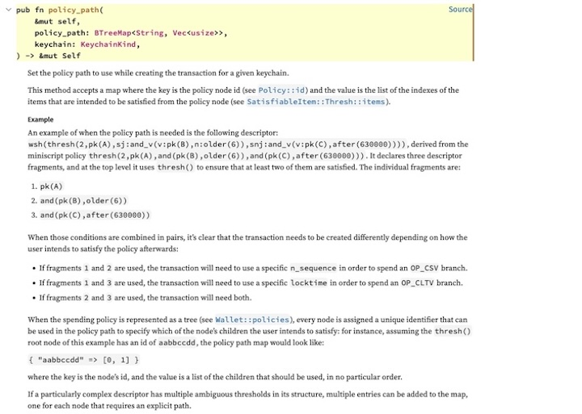

# Planning ahead 📋

#### Building transactions with complex spending conditions in BDK

<br>

**Github**: @ValuedMammal
**X**: @valuedmammal

---

## Policy

<!-- What's the why? -->
<!-- moving beyond single-sig, multi-sig -->
<!-- encoding contingency plans at the level of Bitcoin Script -->
<!-- enables things like high security vaults, preserving privacy -->

This policy says: "Either A and B must sign, or C can sign after 144 blocks have passed since the UTXO was created."

```
or(
    and(pk(A), pk(B)),
    and(pk(C), older(144))
)
```

<br>

Compiled miniscript descriptor (P2WSH)
    
```
wsh(andor(pk(A),pk(B),and_v(v:pk(C),older(144))))
```

---
## The `policy_path` API

https://docs.rs/bdk_wallet/2.1.0/bdk_wallet/struct.TxBuilder.html#method.policy_path

<!-- docs.rs -->


---
### Policy (cont'd)
<!-- _class: slide -->

<!-- descriptor -->

```
wsh(thresh(2,pk(A),sj:and_v(v:pk(B),n:older(6)),snj:and_v(v:pk(C),after(630000))))
```

A: `[e5c7abd3/84h/0h/0h]xpub6BtRAUCU5BTosU6UhHXAskUqHbb5Ud2ijxWgwV6HoLYpdZJqBAiWhkMiPVWFHRMn2GEssUDDq3mxCgyGHARtwHQZoyXxXDtR5ToUvq3cU7d/0/*`  
B: `[9421f833/84h/0h/0h]xpub6CiZyifs86jgdhz6EHPRkqBWPMuJHjooamCLHFXKB6bzDKo6SS55UVCKEUcCZo5KChJkB29tP79H7mFieJtiRDJTiJbcuUnkD6drFhW4cd4/0/*`
C: `[6de9955d/84h/0h/0h]xpub6BrWXUpwTKEfNqBxJZAFbEgAv5aGr5CuUKKBrTqGSpAPhwT9wkKp2ydvamUxcNNKad7qzkzpWeoySKXceBKcFHAJCvjD8og7wvxbV8agsrF/0/*`

---
### Policy (cont'd)
<!-- Policy object -->
```
{
    id: "w4vpzs9c",
    item: Thresh {
        items: [
            Policy {
                id: "j7fc067u",
                item: EcdsaSignature(
                    Pubkey(
                        PublicKey {
                            compressed: true,
                            inner: PublicKey(
                                66590627d359ecdebc304e50df2e78ddaf1a5fb234ff30de5aec671e7dd027bd1bae571da757302f129f7ddc66f114efbe0fe31bd966c3ad32efdc064d90e7d3,
                            ),
                        },
                    ),
                ),
                satisfaction: None,
                contribution: Complete {
                    condition: Condition {
                        csv: None,
                        timelock: None,
                    },
                },
            },
            Policy {
                id: "e844ja4f",
                item: Thresh {
                    items: [
                        Policy {
                            id: "n3sj28kh",
                            item: EcdsaSignature(
                                Pubkey(
                                    PublicKey {
                                        compressed: true,
                                        inner: PublicKey(
                                            9cb0f5f0acecc3668e1c27c66a296d0baf8f8c0ca784eff9e34c9c1382dd897cd967404e190afc80ec5370daa7e884a7c6d059308a80994e0ae2075198f5a7c3,
                                        ),
                                    },
                                ),
                            ),
                            satisfaction: None,
                            contribution: Complete {
                                condition: Condition {
                                    csv: None,
                                    timelock: None,
                                },
                            },
                        },
                        Policy {
                            id: "cmxxtyq5",
                            item: RelativeTimelock {
                                value: Blocks(
                                    Height(
                                        6,
                                    ),
                                ),
                            },
                            satisfaction: None,
                            contribution: Complete {
                                condition: Condition {
                                    csv: Some(
                                        Sequence(0x00000006),
                                    ),
                                    timelock: None,
                                },
                            },
                        },
                    ],
                    threshold: 2,
                },
                satisfaction: Partial {
                    n: 2,
                    m: 2,
                    items: [],
                    sorted: None,
                    conditions: {},
                },
                contribution: PartialComplete {
                    n: 2,
                    m: 2,
                    items: [
                        0,
                        1,
                    ],
                    sorted: None,
                    conditions: {
                        [
                            0,
                            1,
                        ]: {
                            Condition {
                                csv: Some(
                                    Sequence(0x00000006),
                                ),
                                timelock: None,
                            },
                        },
                    },
                },
            },
            Policy {
                id: "e5wzq6h4",
                item: Thresh {
                    items: [
                        Policy {
                            id: "dvt7p936",
                            item: EcdsaSignature(
                                Pubkey(
                                    PublicKey {
                                        compressed: true,
                                        inner: PublicKey(
                                            7600ae9258ef3a68c8da7949b537a49a28fd7f55222dc9814dc2d544c4e6d7e8b3c413ff9a22975ab574e1deb673fca6b1898008fd11dde692b287cc08035670,
                                        ),
                                    },
                                ),
                            ),
                            satisfaction: None,
                            contribution: Complete {
                                condition: Condition {
                                    csv: None,
                                    timelock: None,
                                },
                            },
                        },
                        Policy {
                            id: "xpf2twg8",
                            item: AbsoluteTimelock {
                                value: 630000 blocks,
                            },
                            satisfaction: None,
                            contribution: Complete {
                                condition: Condition {
                                    csv: None,
                                    timelock: Some(
                                        630000 blocks,
                                    ),
                                },
                            },
                        },
                    ],
                    threshold: 2,
                },
                satisfaction: Partial {
                    n: 2,
                    m: 2,
                    items: [],
                    sorted: None,
                    conditions: {},
                },
                contribution: PartialComplete {
                    n: 2,
                    m: 2,
                    items: [
                        0,
                        1,
                    ],
                    sorted: None,
                    conditions: {
                        [
                            0,
                            1,
                        ]: {
                            Condition {
                                csv: None,
                                timelock: Some(
                                    630000 blocks,
                                ),
                            },
                        },
                    },
                },
            },
        ],
        threshold: 2,
    },
    satisfaction: Partial {
        n: 3,
        m: 2,
        items: [],
        sorted: None,
        conditions: {},
    },
    contribution: PartialComplete {
        n: 3,
        m: 2,
        items: [
            0,
            1,
            2,
        ],
        sorted: None,
        conditions: {
            [
                0,
                1,
            ]: {
                Condition {
                    csv: Some(
                        Sequence(0x00000006),
                    ),
                    timelock: None,
                },
            },
            [
                0,
                2,
            ]: {
                Condition {
                    csv: None,
                    timelock: Some(
                        630000 blocks,
                    ),
                },
            },
            [
                1,
                2,
            ]: {
                Condition {
                    csv: Some(
                        Sequence(0x00000006),
                    ),
                    timelock: Some(
                        630000 blocks,
                    ),
                },
            },
        },
    },
}
```

---
## Introducing the `Plan`

#### What:

"A plan represents a particular spending path on a descriptor. It contains the witness template and
the timelocks needed for satisfying the plan. Calling `plan` on a descriptor will return this
structure, containing the cheapest spending path possible considering the assets given."

<https://docs.rs/miniscript/12.3.5/miniscript/plan/struct.Plan.html>

#### Why:
The plan finds the minimum satisfaction out of a set of satisfiable conditions.
This has a few benefits:

* Preserving privacy by not revealing every possible condition
* Saves on-chain fees

#### How:
By "...calling `plan` on a descriptor ... considering the assets given."  
But wait... assets?

---
### Primer on `Assets`

- **def**: Information that we bring to the transaction indicating the conditions we intend to satisfy.
- **example**: A single-sig transaction has a single satisfiable condition, i.e. the signature.
Therefore the asset is the key with which we're able to produce the signature.
- Kinds of assets include keys, hash (pre)images, and timelocks
- **Note**: The assets consist of public information.
A "key" is denoted by the combination of a fingerprint + derivation path (i.e. key source),
along with the signing context in which it can sign (ECDSA, Schnorr).

### Putting it together
<!-- schematic flow -->

Descriptor + Derivation Index -> Definite Descriptor
Definite Descriptor + Assets -> Plan
Plan + Previous Transaction Output (UTXO) -> Input (with satisfaction weight)
(weighted) Input + Output + Feerate -> Coin Selection -> PSBT
PSBT + Satisfaction (cryptographic signature) -> Transaction

<!-- Recap: What did we actually accomplish? -->
<!-- recall the plan gives us the _minimum satisfaction_ -->
<!-- without this, we'd be forced to rely on something like "max weight to satisfy" -->
<!-- this is incredibly wasteful if a single uncommon path requires a large satisfaction -->

---
## Example inheritance plan

<!-- Descriptor -->

```
tr(X,{multi_a(2,A,B),and_v(v:pk(C),older(52560))})
```

#### Assets
pk (internal): `X`  
pk: `A`, `B`, `C`  
older: `52560` blocks

---

# Concept check Qs

<!-- Questions -->

For each set of assets, what is the chosen spend path, and what is the resulting tapscript?

```
tr(X,{multi_a(2,A,B),and_v(v:pk(C),older(52560))})
```

1. Keys `[A, B]`
    <!-- multi_a: `<A> OP_CHECKSIG <B> OP_CHECKSIGADD OP_PUSHNUM_2 OP_NUMEQUAL` -->

    1a. Key `A`
    <!-- Err: The assets are insufficient -->

2. Key `C` + `52560` blocks
    <!-- csv: `<C> OP_CHECKSIGVERIFY <50cd00> OP_CHECKSEQUENCEVERIFY` -->

3. Say we just lazily add all of the assets indiscriminately `X` + `[A, B, C]` + `52560` blocks
    hint: See `best_tap_spend` <https://github.com/rust-bitcoin/rust-miniscript/blob/2ca5a35d0b5277940a3d75f4daf8f8429bb56dbd/src/descriptor/tr/mod.rs#L457>
    <!-- ans: The whole idea of the Plan construct is to find the minimum satisfaction, so in this case just the internal key is used, no tapscript -->
    <!-- `<X> OP_CHECKSIG` -->

    ref: https://github.com/bitcoin/bips/blob/master/bip-0379.md
    ref: https://bitcoin.sipa.be/miniscript/
---

# Discussion

Thank you for coming to my tech talk
